# AWS CDK Enterprise Infrastructure

This project provisions a serverless enterprise-grade infrastructure using AWS CDK with TypeScript.
It implements a Lambda API (exposed via API Gateway), persistent storage (S3), and networking (VPC + subnets) — all automated and deployed via GitHub Actions CI/CD.

---

## 🗂️ Project Structure
```bash
aws-cdk-enterprise-infra/
├── bin/                     # CDK app entry
│   └── app.ts
├── lib/                     # Infrastructure constructs
│   ├── constructs/
│   │   ├── lambda-api.ts    # Lambda + API Gateway
│   │   ├── networking.ts    # VPC + subnets
│   │   └── storage.ts       # S3 bucket
│   └── infrastructure-stack.ts
├── lambda/                  # Lambda handler source
│   └── index.js
├── test/                    # Jest tests for infra
│   └── infrastructure.test.ts
├── .github/workflows/       # CI/CD pipelines
│   └── ci-cd.yml
├── package.json
├── public/
├── cdk.json
├── tsconfig.json
├── .gitignore
└── README.md
```

---
## 🚀 Step-by-Step Setup
✅ Prerequisites
- AWS account with an IAM user that cn deploy infra
- AWS CLI v2 configured: `aws configure` or AWS SSO. Verify:
  ```bash
  aws sts get-caller-identity
  ```
- Node.js LTS (>= 18) and npm. Verify:
  ```bash
  node -v
  npm -v
  ``` 
- AWS CDk v2:
  ```bash
  npm install -g aws-cdk@2
  cdk --version
  ```
- TypeScript (installed per project) and ts-node for CDK app entry.
- Git and a GitHub account (push repo).
- Docker (optional but useful if you build Lambda assets or container images).
- Editor: VS Code recommended + TypeScript/Jest extensions.
- Basic knowledge of: IAM, VPC, subnets, NAT GW, Lambda, API Gateway, S3, CloudFormation, plus TypeScript interfaces & generics and Jest testing


### 1. Clone the Repository 

  ```bash
  git clone git@github.com:Pascalpedro/aws-cdk-enterprise-infra.git
  cd aws-cdk-enterprise-infra

  npm init -y   # init npm
  ```

### 2. Install Dependencies
```bash
npm install aws-cdk-lib constructs
npm install --save-dev jest ts-jest typescript @types/jest @types/node
```

### 3. Bootstrap the AWS environment
CDK needs the bootstrap stack in the account/region
  ```bash
  # with default profile/region
  cdk bootstrap aws://$(aws sts get-caller-identity --query Account --output text)/us-east-1
  
  cdk init app --language typescript
  ```

### 4. Verify `Constructs` and Source codes
- Lambda + API Gateway → lib/constructs/lambda-api.ts
- S3 bucket → lib/constructs/storage.ts
- Networking (VPC) → lib/constructs/networking.ts
- Root stack wires everything in lib/infrastructure-stack.ts.
- Lambda function → lambda/index.js

### 5. Tests && Deployment 
- Run unit tests locally to validate the infra setup:
```bash
npm run test 
# Expect: green tests asserting synthesized CloudFormation. If tests fail, inspect cdk.out and the synthesized template.
```

- Run local build to compile Typescript & make sure everything builds:
```bash
npm run build
```

- To Generate CloudFormation templates without deploying:
```bash
npm run synth
# Check the output cdk.out/ folder and verify your template looks right.
```

- To show changes and compare local vs deployed stack:
```bash
npm run diff
```
- To deploy stack to AWS:
```bash
npm run deploy
# This provisions the stack (with 0NATS, auto-cleanup S3, etc)
``` 

- To test the API endpoint:
```bash
curl https://<api-endpoint>/prod/
```
- Expected output:
  ```json
  {
  "message": "Hello from Lambda!! This is a PedroOps implementation using AWS CDK + Typescript...",
  "bucket": "infrastructurestack-appbucket12345678"
  }
  ```
 - Check your S3 bucket:
   ```bash
   aws s3 ls s3://<your-bucket-name>/  # You’ll see a test-object-<timestamp>.txt
    ```

### 6. Verify deployment & validate Resources
- CloudFormation stack status: CREATE_COMPLETE
- Find HttpApiUrl output in CloudFormation Outputs or CDK output, hit the endpoint in browser/curl.
- Check Lambda logs: CloudWatch → Log Groups → /aws/lambda/<functionName>
- Check resources in console: VPC (subnets, NAT), S3 bucket, API Gateway.
- Lambda → Invoke via API Gateway URL
- S3 → Check file uploads (aws s3 ls s3://<bucket-name>)
- Networking → Confirm subnets/VPC in AWS Console

### 7. Troubleshooting Log errors/Debugging:

- Check Lambda logs in CloudWatch (Get your Lambda name)
  ```bash
  aws lambda list-functions --query 'Functions[*].FunctionName' --output text
  ```

- Find the log group for your Lambda (/aws/lambda/...).
  ```bash
  aws logs describe-log-groups --query 'logGroups[*].logGroupName'
  ```

- Then, tail the logs:
  ```bash
  aws logs tail /aws/lambda/<LambdaName> --follow
  ```

- Trigger the API again in another terminal, watch the error logs.
  ```bash
  curl https://<api-endpoint>/prod/
  ```
You should see the exact error (e.g., BUCKET_NAME is undefined, AccessDenied, Handler not found, etc.).

### 8. Implement CI/CD with GitHub Actions
- Add a simple GitHub Actions workflow (`.github/workflows/ci-cd.yml`) to run `npm ci && npm run test && npm run synth` on push.
- Uses GitHub OIDC + IAM Role (no stored AWS secrets).
- Flow:
  - ✅ PR → main → runs build + test only
  - ✅ Merge → main → runs deploy via CDK


---
## 🔒 Safety Practices
- OIDC + IAM Role → No AWS keys in GitHub.
- Least Privilege → Restrict role to only required services (Lambda, S3, API Gateway, VPC, CloudFormation).
- Branch Protection → No direct pushes to main. Use PRs + reviews.
- Approval Gates → Optional manual approval for production deploys.

## 💰 Cost Optimization
This project is configured with **cost-conscious defaults**:
- `natGateways: 0` → avoids NAT gateway charges (~$30/month each).
- S3 bucket → `RemovalPolicy.DESTROY` and `autoDeleteObjects: true` to prevent lingering storage costs.
- Lambda, API Gateway, and other resources are lightweight and safe for demo usage.
- Minimal VPC footprint.
- Monitor CloudWatch logs → catch runaway invocations.


## 🎯 Production Considerations

For a **production environment**, you would typically:
- Set `natGateways: 2` for high availability.
- Configure S3 buckets with `RemovalPolicy.RETAIN` to avoid accidental data loss.
- Harden security groups and IAM policies with stricter rules.
- Add monitoring/alerts (e.g., CloudWatch Alarms).
- Enable logging for API Gateway and Lambda.


## 📈 Scaling Considerations

- Modular constructs allow independent scaling (e.g., add more Lambda APIs, expand VPC).
- Use multi-stack deployments for large projects.
- GitHub Actions matrix builds to test across Node.js versions.
- Add CloudFront + WAF for production security.
- Introduce parameterized environments (dev/stage/prod) when moving beyond safe defaults.

---

## 📷 Screenshots
Below are step-by-step screenshots demonstrating the infrastructure build, CI/CD pipeline, and resource validation.

### 1. Development & CI/CD

Local tests passing; showing tests running locally

Local CDK Deploy; showing CDK deploying locally.

GitHub Actions workflow running (green)

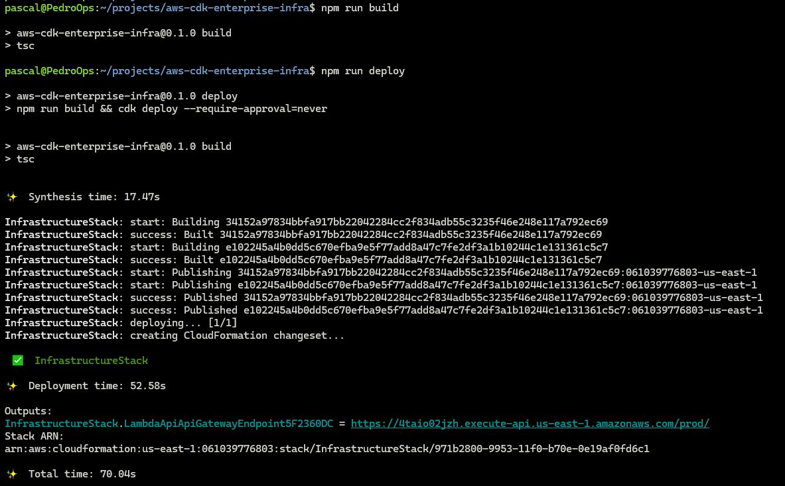GitHub Actions build + deploy logs

### 2. Infrastructure Provisioned

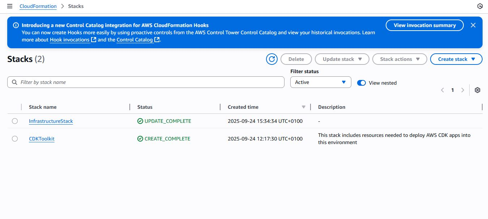CloudFormation stack details (infrastructure successfully deployed)

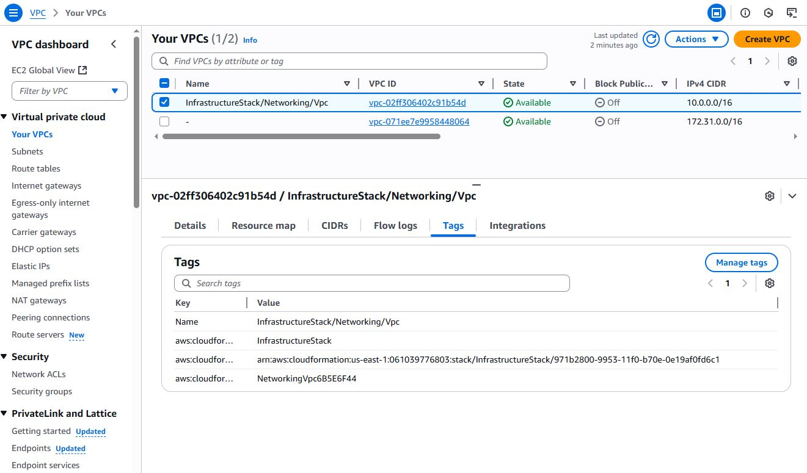VPC created by VPC

Subnet layout

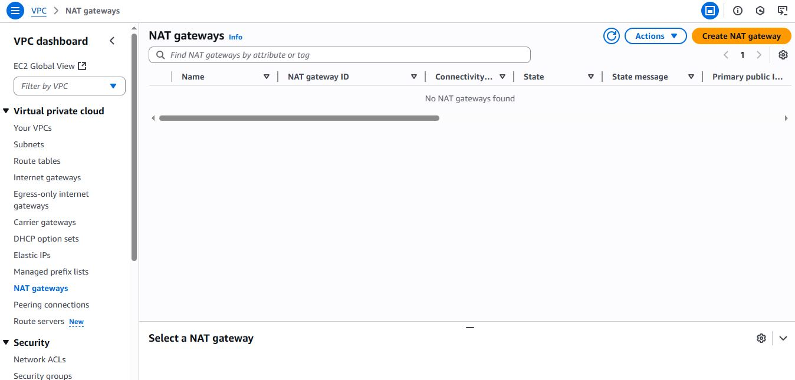Showing Zero NAT Gateway provisioned

### 3. Lambda + API Gateway

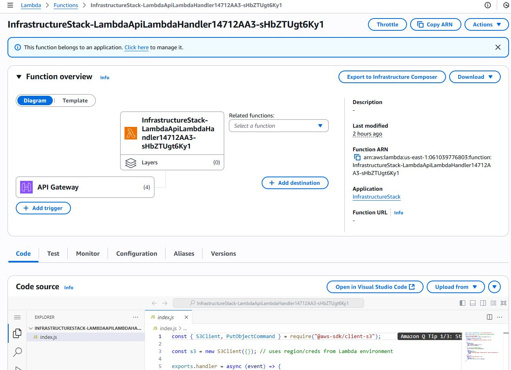Lambda function overview in AWS Console

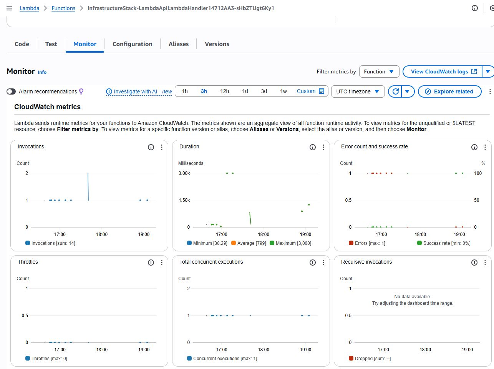 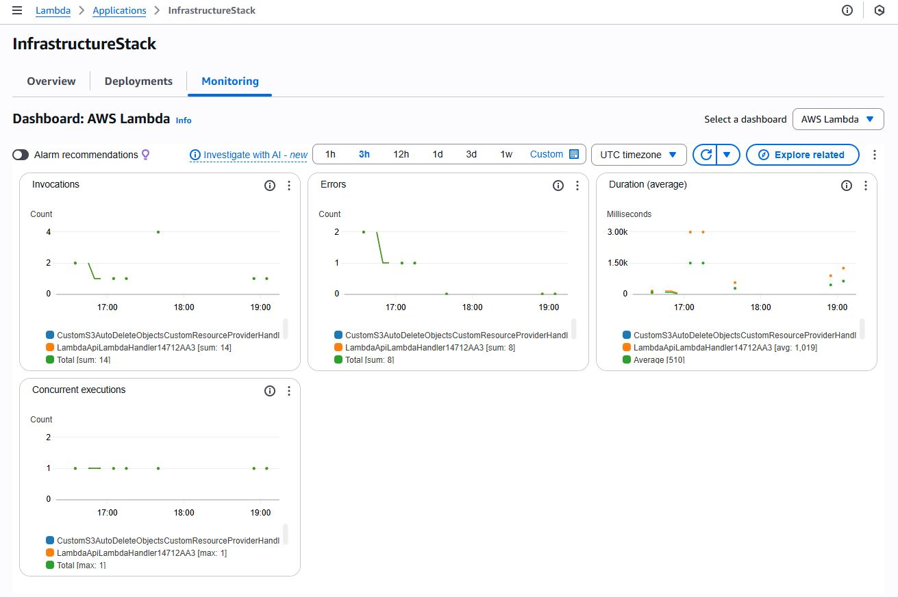Monitoring tab (invocation graphs)

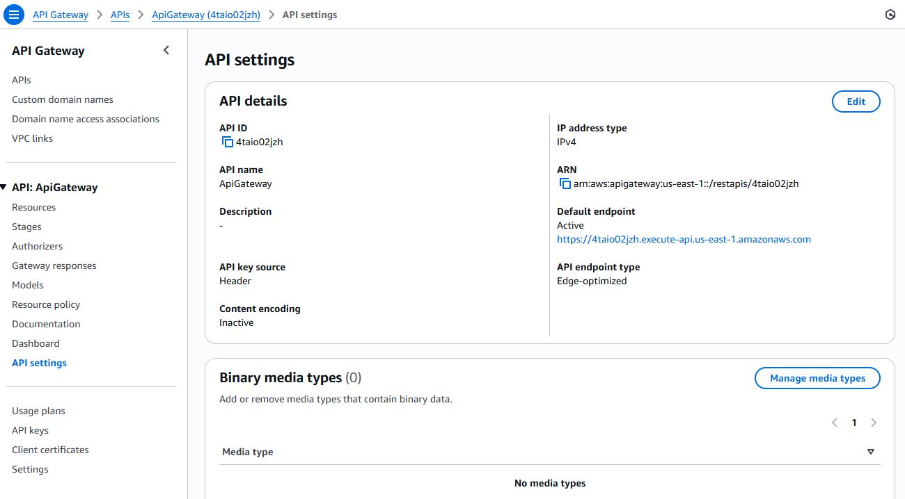API Gateway endpoint details

Local curl hitting the API Gateway endpoint

### 4. Validation (Logs + Storage)

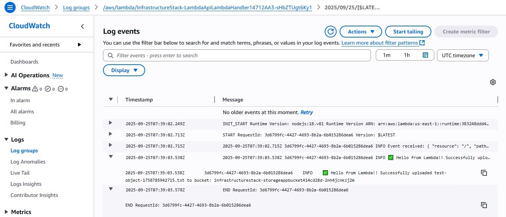CloudWatch logs showing event + “Hello from Lambda!!”

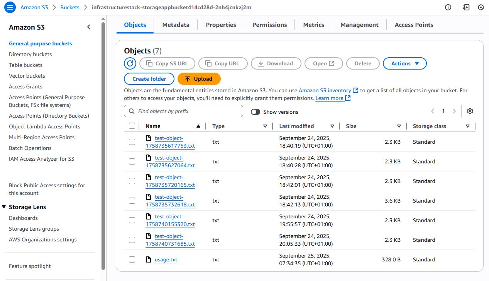S3 console showing uploaded object

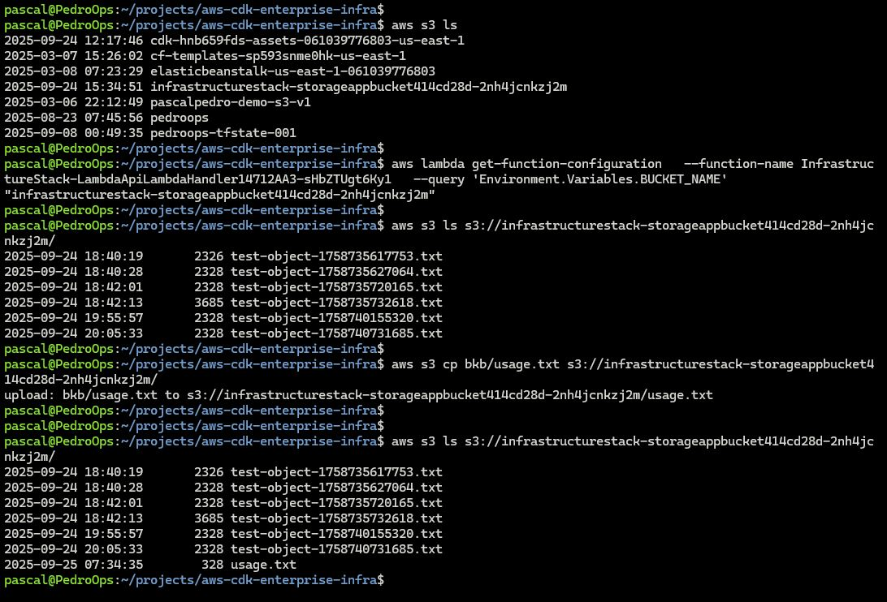CLI verification of uploaded S3 file.

⚡ This:
- Shows CI/CD worked.
- Proves infra resources exist.
- Confirms Lambda + API Gateway + S3 + CloudWatch are functional.


## 🧹 Cleanup

When finished, destroy resources to avoid costs:
```bash
npm run destroy
``` 

## Usage
```bash
npm run test     # To run unit tests
npm run build    # To compile Typescript
npm run synth    # Generate CloudFormation templates
npm run deploy   # Deploy stack to AWS
npm run diff     # Compare local vs deployed stack
npm run destroy  # Destroy stack to save cost
``` 

This project demonstrates the architecture and IaC workflow while keeping costs minimal.

In a production setup, this infra would use multiple NAT Gateways and set S3 buckets to RETAIN instead of DESTROY. For this demo, I configured cost-conscious defaults.

---
## 🤝 Contribution Guidelines
We welcome contributions! Please follow these steps:
1. Fork the repository
2. Create your feature branch (git checkout -b feature/YourFeature)
3. Commit changes with meaningful messages. (git commit -m 'Add YourFeature')
4. Push to the branch (git push origin feature/YourFeature)
5. Submit a Pull Request


## 📬 Author
- **Pascal Attama**
- **Email: Attamapascalpedro@gmail.com**
- **Website: https://www.pedroops.com**
- **GitHub: [@Pascalpedro](https://github.com/Pascalpedro)**